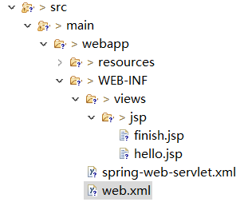
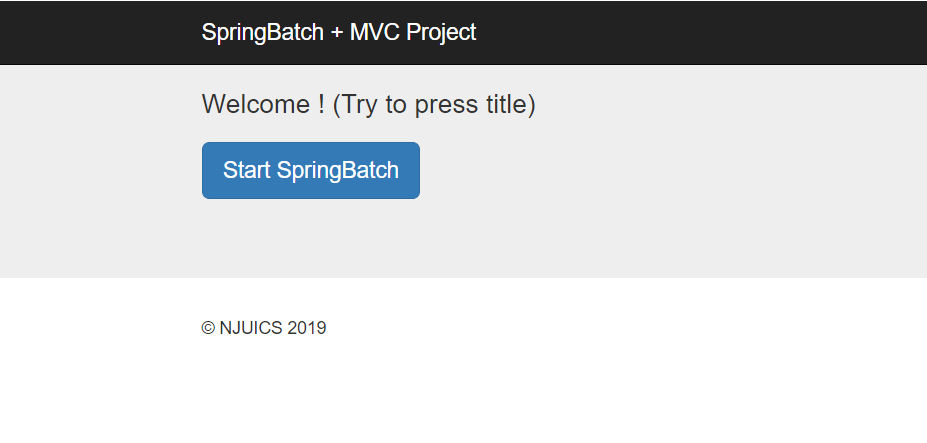
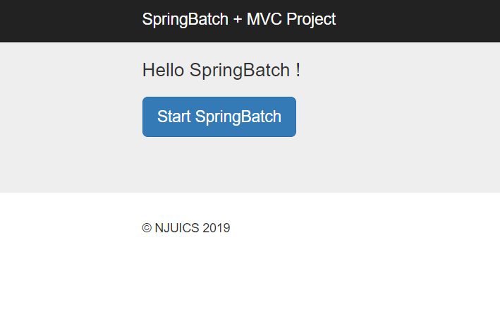
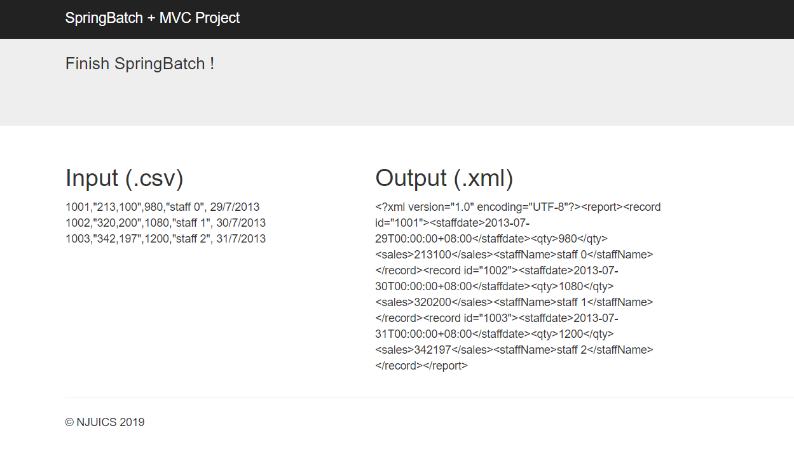

# Spring Batch

基于初始版 [Spring Batch](https://github.com/njuics/demos/tree/master/springbatch)（.csv 转 .xml 版）

添加 Web 界面（参考 [Spring MVC](https://github.com/njuics/demos/tree/master/springmvc)）


### 修改说明

- pom.xml
  基于 [Spring MVC](https://github.com/njuics/demos/tree/master/springmvc) + [Spring Batch](https://github.com/njuics/demos/tree/master/springbatch)

- 删除 App.java（包 cn.edu.nju.sa2017.pipefilter）
  改用 Web 页面触发

- 新增类 SpringBatchController（包 cn.edu.nju.sa2017.mvc）
  替代 App.java 中的 Main 函数

  ```java
  @Controller
  public class SpringBatchController {
  
  	@RequestMapping(value = "/", method = RequestMethod.GET)
  	public String printWelcome(ModelMap model) { ... }
  
  	@RequestMapping(value = "/hello/{name:.+}", method = RequestMethod.GET)
      public ModelAndView hello(@PathVariable("name") String name) {
          ... // 使用：hello.jsp
      }
  
  	@RequestMapping(value = "/finish", method = RequestMethod.GET)
  	public ModelAndView finish() throws IOException {
          ...
          /* 此中操作包括：
           * 1. 使用：finish.jsp
           * 2. 原App.java中的Main函数过程，即启动SpringBatch
           * 3. 读取.csv和.xml文件内容，并通过.jsp中的参数将文件文本添加到Web界面上
           */
  	}
  	...
  }
  ```

- 添加 webapp 文件夹（参考 [Spring MVC](https://github.com/njuics/demos/tree/master/springmvc)）
  对 web.xml 进行适当修改
  修改 .jsp 文件，调整界面

  
  


### Web 界面效果

1. [http://localhost:8080/](http://localhost:8080/)
   （点击 title 跳转到 2；点击按钮开启 SpringBatch 并跳转到 3）

   

2. [http://localhost:8080/hello/SpringBatch/](http://localhost:8080/hello/SpringBatch/)
   （点击按钮开启 SpringBatch 并跳转到 3）

   

3. [http://localhost:8080/finish/](http://localhost:8080/finish/)
   （完成 SpringBatch 并显示结果）

   


